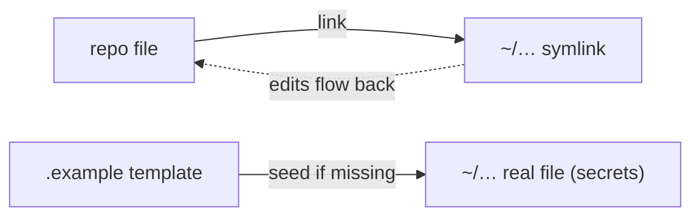

# dotfiles-mac

macOS dotfiles for **`lamp`** (richard). One idempotent installer symlinks
config into place and seeds secret templates. Centerpiece is a heavily
customized **Oh My Pi (`omp`)** setup, plus zsh, Ghostty, and AeroSpace.

> Fresh machine: `git clone … && ./install.sh`, fill in secrets, done.

---

## Repo layout

```
dotfiles-mac/
├── install.sh          # idempotent symlinker (link) + secret seeder (seed)
├── zsh/                # .zshrc, .zprofile, .zsh_secrets.example
├── ghostty/            # terminal config
├── aerospace/          # i3-like tiling WM config
├── claude/             # ~/.claude/CLAUDE.md (SmallDocs context block)
└── omp/                # Oh My Pi coding agent
    ├── config.yml      # model roles, skills, statusline, …
    ├── lsp.json        # custom rust-glancer LSP
    ├── agents/         # swiftui-expert subagent
    ├── extensions/     # herdr state (TS)
    ├── skills/         # 20 vendored skills (baked in)
    └── *.example       # seeded secret templates
```

---

## Install model

Two mechanisms in `install.sh`:

| Verb   | Behavior | Used for |
|--------|----------|----------|
| `link` | Symlink repo → `$HOME`; backs up any real file to `*.bak` | all tracked config |
| `seed` | Copy `.example` → dest **only if missing** | secret files (never overwritten, never committed) |



Because everything is a **symlink back into the repo**, editing `~/.zshrc`
_is_ editing `zsh/.zshrc` — commit from the repo to version changes.

---

## What's configured

| Area | Highlights |
|------|-----------|
| **zsh** | speed-tuned oh-my-zsh (`afowler`, `git` plugin, cached compinit), lazy conda/SDKMAN, fnm + pyenv, portable `$HOME` paths; `.zprofile` = arch-agnostic `brew shellenv` + OrbStack |
| **Ghostty** | Argonaut theme, Maple Mono NF @ 11pt (cv31–37), hidden titlebar, `macos-option-as-alt = left` (word-delete), tmux keybinds, quick-terminal toggle |
| **AeroSpace** | 8px inner/outer gaps, `auto-reload-config`, `start-at-login` |
| **omp** | opus/sonnet model roles, nerd statusline, advisor + STT, custom `rust-glancer` LSP, `swiftui-expert` agent, `herdr` extension, 20 vendored skills |
| **claude** | `~/.claude/CLAUDE.md` SmallDocs context block (sdoc) |

---

## Skills (20, vendored under `omp/skills/`)

Baked into the repo so a clone works offline; symlinked to `~/.omp/agent/skills`
(omp's native user-skills dir, auto-scanned at startup). Everything loads except
names in `skills.ignoredSkills`.

| Source | Skills |
|--------|--------|
| emilkowalski/skills | animate · animation-vocabulary · apple-design · emil-design-eng · find-animation-opportunities · improve-animations · prototype · review-animations |
| JuliusBrussee/caveman | caveman · caveman-compress · caveman-commit · caveman-review · caveman-stats · caveman-help · cavecrew |
| singles | karpathy-guidelines · herdr · gh-stack · impeccable (compiled) · claude-for-safari |

Provenance + per-skill update recipe: `omp/skills/SOURCES.md`.
**smalldocs is not a skill** — it rides in `claude/CLAUDE.md` as context.

---

## Secrets (seeded, git-ignored — fill in real values)

- `~/.zsh_secrets` — `DEEPSEEK_API_KEY`, `ANTHROPIC_API_KEY`
- `~/.omp/agent/models.yml` — litellm gateway key
- `~/.omp/agent/mcp.json` — obsidian bearer token

---

## Fresh-machine setup

1. `git clone https://github.com/richyk1/dotfiles-mac ~/dev/dotfiles-mac`
2. `cd ~/dev/dotfiles-mac && ./install.sh`
3. Fill in the three secret files above.
4. Install prereqs the configs expect: **oh-my-zsh, homebrew, fnm, pyenv**, plus
   optional tools (`rust-glancer` for Rust LSP, `sdoc`, `herdr`, Maple Mono NF font,
   AeroSpace).
5. Restart Ghostty / `omp`.
